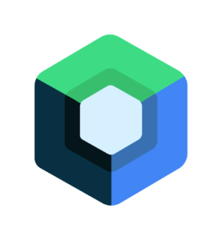

  
  

  
  
  

  

  ---
  
<h3> 👨🏻‍💻 About Me </h3>
Hi, i'm Iyke Emmanuel, a passionate self-taught mobile developer and a freelance from <b>Nigeria</b>. i'm skilled in creating high-quality, user-friendly apps. With experience in Flutter, Jetpack Compose, and native Android development, I am confident in my ability to deliver robust, scalable, and High performing mobile applications.

  I have a solid understanding of app architecture patterns, design principles, and software development best praticeses. I take pride in writing clean, readable, and maintainable code that meets the needs of users and other fellow developers. I am also an open-source enthusiast and maintainer. I learnt a lot from the open-source community and I love how collaboration and knowledge sharing is encouraged in opensource.

I am always seeking new challenges and opportunities to grow as a developer. If you're looking for a talented and driven mobile developer, I would be happy to discuss how I can contribute to your next project."

  ### 📕 Latest Blog Posts
<!-- BLOG-POST-LIST:START -->
- [Unlock Your Full Potentials In Tech by Contributing to Opensource](https://emmanueldav.medium.com/unlock-your-full-potentials-in-tech-by-contributing-to-open-source-2a663bd4381d)
- [Fetching Api with jetpack Compose](https://medium.com/@emmanueldav/fetching-data-from-api-in-jetpack-compose-5598fa55428d)
- [Future of Kotlin multiplatform](https://medium.com/@emmanueldav/the-future-with-kotlin-multiplatform-6e2eec6abda)
- [Tips and Tricks that will imporove your Android development skill](https://medium.com/@emmanueldav/tips-and-tricks-that-would-improve-your-skills-as-an-android-developer-7e2e81351877)
<!-- BLOG-POST-LIST:END -->
  

<h2 align="left" id="iyke-tech">Favorite Tech</h2>
> Tools, languages, and other things that I like to work with.
<table>
  <tr>
    <td align="center" width="96">
      
       Android
    </td>
    <td align="center" width="96">
      
       Flutter
    </td>
    <td align="center" width="96">
      
       Material UI
    </td>
    <td align="center" width="96">
      
       Firebase
    </td>
    <td align="center" width="96">
      
       Figma
    </td>
    <td align="center" width="96">
      
       Jetpack compose
    </td>
    <td align="center" width="96">
      
       Git
    </td>
    <td align="center" width="96">
      
       Espresso
    </td>
    <td align="center" width="96">
      
       Mockito 
    </td>
  </tr>
  <tr>
    <td align="center" width="96"> 
      
       Kotlin
    </td>
    <td align="center" width="96">
      
       Dart
    </td>
    <td align="center"  width="96">
      
       Java
    </td>
    <td align="center"  width="96">
      
       Python
    </td>
    <td align="center" width="96">
      
       Tensorflow
    </td>
    <td align="center"  width="96">
      
       Google Play
    </td>
    <td align="center" width="96">
      
       Google Analytics
    </td>
    <td align="center" width="96">
      
       Jira
    </td>
    <td align="center" width="96">
      
       App store
    </td>
  </tr>
</table>
